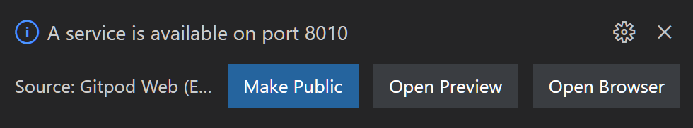

# **TodoDB**

The **TodoHub** is a Web server application to demonstrate the features of the
[**JSON Fliox**](https://github.com/friflo/Friflo.Json.Fliox#-features) **.NET** library.

*In short*  
**JSON Fliox** is .NET library supporting simple and efficient access to SQL & NoSQL databases via C# or Web clients.

For a simple setup the server **is also the database** storing records (entities) in the **file-system**.  
This enables running the server **without** any configuration or installation of a third party DBMS (database management system).


## TodoClient

The key class when running a HTTP server using **Fliox Hub** is [**TodoClient.cs**](Client/TodoClient.cs).  
This class provide two fundamental functionalities:
1. It is a **database client** providing type-safe access to its containers, commands and messages
2. It defines a **database schema** by declaring its containers, commands and messages.  
  The schema is used by host for **entity validation** and exposing the schema in various formats:  
  **JSON Schema**, **OpenAPI**, **GraphQL**, **HTML**, **Typescript**, **C#** & **Kotlin**.


## Files
```
📂 Client
┣ 📄 TodoClient.cs      1. is a database client
┃                       2. is a database schema for a Hub
📂 Hub
┣ 📄 Program.cs         bootstrapping & configuration of host   > dotnet run
┣ 📄 Provider.cs        use DB provider: memory, file, SQLite, MySQL, MariaDB, PostgreSQL or SQL Server
┣ 📄 Startup.cs         ASP.NET Core 6.0 integration
📂 Test
┣ 📄 TodoTests.cs       unit tests                              > dotnet test
┗ 📄 Trial.cs           small samples                           > dotnet run
```

# 🔧 Build

The solution and its projects can be build, tested and executed on **Windows**, **Linux**, and **macOS**.  
It can be used with following IDE's:
[Visual Studio Code](https://code.visualstudio.com/),
[Rider](https://www.jetbrains.com/rider/) &
[Visual Studio 2022](https://visualstudio.microsoft.com/vs/).

*Note*: In order to build and run the examples the [**.NET 6.0 SDK**](https://dotnet.microsoft.com/en-us/download) is required.


Or use **Gitpod** to build and run the server using VSCode in the browser without installing anything.  
Workspace available in 30 sec. Open  <a href="https://gitpod.io/#https://github.com/friflo/Fliox.Example.TodoDB" target="_blank">
  
</a>  in new tab. When Finished open Terminal panel.

<br/>

clone repository and open its directory - leave out this step when using Gitpod.
```cmd
git clone git@github.com:friflo/Fliox.Example.TodoDB.git
cd Fliox.Example.TodoDB
```

build all examples
```cmd
dotnet build
⏩
Build succeeded.
    0 Warning(s)
    0 Error(s)
```

run unit tests of all examples
```cmd
dotnet test
⏩
Passed! - Failed: 0, Passed: 7, Skipped: 0, Total: 7, Duration: 421 ms - TodoTest.dll (net6.0)
```

run a Hub as an HTTP server from its folder - e.g.
```cmd
cd ./Hub
dotnet run
```
the server will start with logs like

```
info:  add extension db: 'cluster' (in-memory)
info:  create HttpHost db: 'main_db' (file-system)
info:  TodoDB · dev - v1.0.0,   Friflo.Json.Fliox - v0.42.0
    ____   _   _
   |  __| | | |_|  ____  __  __
   |  _|  | | | | | __ | \ \/ /
   |_|    |_| |_| |____| /_/\_\   .oOo.  ..oo.  .oOOo..
...
Hub Explorer - http://localhost:8010/fliox/
```


when using Gitpod:
- Click **Make Public**  
- Click **`http://localhost:8010/fliox/`**  in Terminal  


<br/>

Otherwise open the **Hub Explorer** in your browser: http://localhost:8010/fliox/

<br/>

run the .NET Test client accessing the Hub from its folder - e.g.
```cmd
cd ./Todo/Test
dotnet run
⏩
--- jobs:
id: 1, title: buy milk, completed: False
id: 2, title: buy cheese, completed: True

 wait for events ... (exit with: CTRL + C)
 note: generate events by clicking 'Save' on a record in the Hub Explorer
```
It will execute the client methods used in `Trial.Main()`